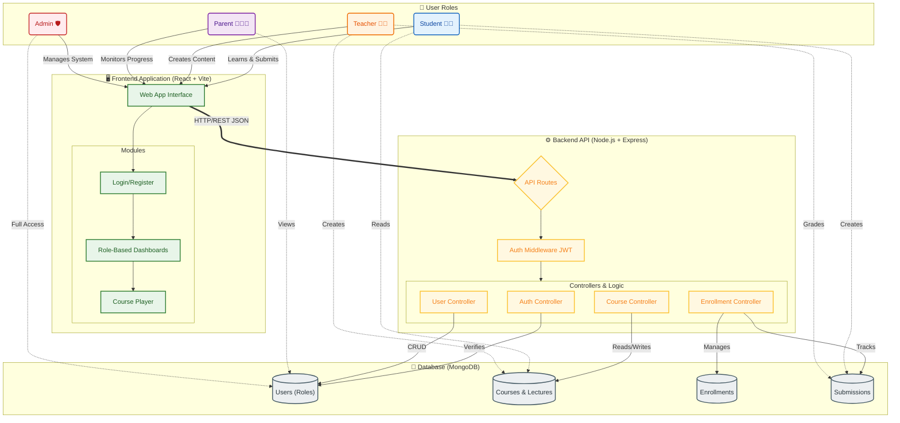

# 🏗️ Project Architecture

This document outlines the high-level architecture of the application, including the Frontend, Backend, Database, and User Roles.

## Description of Architecture

1.  **User Roles**:
    *   **Student**: Accesses courses, watches lectures, takes quizzes, and submits assignments.
    *   **Teacher**: Creates courses, uploads lectures, manages content, and grades submissions.
    *   **Parent**: Links to their children's accounts to monitor progress and attendance.
    *   **Admin**: Oversees the entire platform, manages users, and handles system configurations.

2.  **Frontend**:
    *   Built with **React** and **Vite** for a fast, modern single-page application experience.
    *   Uses **Role-Based Dashboards** to show relevant information for each user type.

3.  **Backend**:
    *   **Node.js** and **Express** provide a robust RESTful API.
    *   **JWT Authentication** ensures secure access to routes.
    *   **Middleware** handles role verification (e.g., only Teachers can create courses).

4.  **Database**:
    *   **MongoDB** stores all application data in a flexible, document-oriented format.
    *   Collections include Users, Courses, Lectures, Enrollments, and Submissions.
