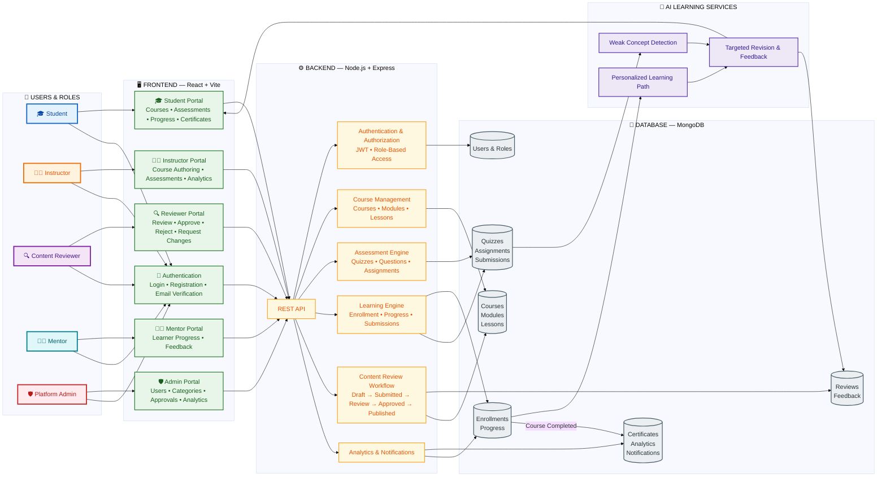

# 🏗️ Project Architecture

This document outlines the high-level architecture of the application, including the Frontend, Backend, Database, and User Roles.

```mermaid
%%{init: {
  "theme": "base",
  "flowchart": {
    "curve": "basis",
    "nodeSpacing": 45,
    "rankSpacing": 65
  },
  "themeVariables": {
    "fontSize": "18px",
    "fontFamily": "Arial"
  }
}}%%

flowchart LR

%% =====================================================
%% USERS
%% =====================================================

subgraph USERS["👥 USERS & ROLES"]
    direction TB

    S["🎓 Student"]
    I["👨‍🏫 Instructor"]
    R["🔍 Content Reviewer"]
    M["🧑‍🏫 Mentor"]
    A["🛡️ Platform Admin"]
end


%% =====================================================
%% FRONTEND
%% =====================================================

subgraph FRONTEND["🖥️ FRONTEND — React + Vite"]
    direction TB

    AUTH["🔐 Authentication<br/>Login • Registration • Email Verification"]

    STUDENT["🎓 Student Portal<br/>Courses • Assessments • Progress • Certificates"]

    INSTRUCTOR["👨‍🏫 Instructor Portal<br/>Course Authoring • Assessments • Analytics"]

    REVIEWER["🔍 Reviewer Portal<br/>Review • Approve • Reject • Request Changes"]

    MENTOR["🧑‍🏫 Mentor Portal<br/>Learner Progress • Feedback"]

    ADMIN["🛡️ Admin Portal<br/>Users • Categories • Approvals • Analytics"]
end


%% =====================================================
%% BACKEND
%% =====================================================

subgraph BACKEND["⚙️ BACKEND — Node.js + Express"]
    direction TB

    API["REST API"]

    AUTHAPI["Authentication & Authorization<br/>JWT • Role-Based Access"]

    COURSE["Course Management<br/>Courses • Modules • Lessons"]

    ASSESS["Assessment Engine<br/>Quizzes • Questions • Assignments"]

    LEARNING["Learning Engine<br/>Enrollment • Progress • Submissions"]

    REVIEW["Content Review Workflow<br/>Draft → Submitted → Review → Approved → Published"]

    ANALYTICS["Analytics & Notifications"]
end


%% =====================================================
%% AI
%% =====================================================

subgraph AI["🤖 AI LEARNING SERVICES"]
    direction TB

    AI1["Personalized Learning Path"]

    AI2["Weak Concept Detection"]

    AI3["Targeted Revision & Feedback"]
end


%% =====================================================
%% DATABASE
%% =====================================================

subgraph DATABASE["💾 DATABASE — MongoDB"]
    direction TB

    USERSDB[("Users & Roles")]

    COURSEDB[("Courses<br/>Modules<br/>Lessons")]

    ASSESSDB[("Quizzes<br/>Assignments<br/>Submissions")]

    LEARNDB[("Enrollments<br/>Progress")]

    REVIEWDB[("Reviews<br/>Feedback")]

    CERTDB[("Certificates<br/>Analytics<br/>Notifications")]
end


%% =====================================================
%% USER → FRONTEND
%% =====================================================

S --> STUDENT
I --> INSTRUCTOR
R --> REVIEWER
M --> MENTOR
A --> ADMIN

S --> AUTH
I --> AUTH
R --> AUTH
M --> AUTH
A --> AUTH


%% =====================================================
%% FRONTEND → BACKEND
%% =====================================================

AUTH --> API

STUDENT --> API
INSTRUCTOR --> API
REVIEWER --> API
MENTOR --> API
ADMIN --> API


%% =====================================================
%% BACKEND FLOW
%% =====================================================

API --> AUTHAPI

API --> COURSE
API --> ASSESS
API --> LEARNING
API --> REVIEW
API --> ANALYTICS


%% =====================================================
%% BACKEND → DATABASE
%% =====================================================

AUTHAPI --> USERSDB

COURSE --> COURSEDB

ASSESS --> ASSESSDB

LEARNING --> LEARNDB
LEARNING --> ASSESSDB

REVIEW --> REVIEWDB
REVIEW --> COURSEDB

ANALYTICS --> CERTDB
ANALYTICS --> LEARNDB


%% =====================================================
%% AI FLOW
%% =====================================================

LEARNDB --> AI1
ASSESSDB --> AI2

AI1 --> AI3
AI2 --> AI3

AI3 --> REVIEWDB

AI3 --> STUDENT


%% =====================================================
%% CERTIFICATE
%% =====================================================

LEARNDB -->|Course Completed| CERTDB


%% =====================================================
%% STYLING
%% =====================================================

classDef student fill:#E3F2FD,stroke:#1565C0,stroke-width:3px,color:#0D47A1;
classDef instructor fill:#FFF3E0,stroke:#EF6C00,stroke-width:3px,color:#E65100;
classDef reviewer fill:#F3E5F5,stroke:#7B1FA2,stroke-width:3px,color:#4A148C;
classDef mentor fill:#E0F7FA,stroke:#00838F,stroke-width:3px,color:#006064;
classDef admin fill:#FFEBEE,stroke:#C62828,stroke-width:3px,color:#B71C1C;

classDef frontend fill:#E8F5E9,stroke:#2E7D32,stroke-width:2px,color:#1B5E20;
classDef backend fill:#FFF8E1,stroke:#F9A825,stroke-width:2px,color:#E65100;
classDef ai fill:#EDE7F6,stroke:#5E35B1,stroke-width:2px,color:#311B92;
classDef database fill:#ECEFF1,stroke:#455A64,stroke-width:2px,color:#263238;

class S student;
class I instructor;
class R reviewer;
class M mentor;
class A admin;

class AUTH,STUDENT,INSTRUCTOR,REVIEWER,MENTOR,ADMIN frontend;

class API,AUTHAPI,COURSE,ASSESS,LEARNING,REVIEW,ANALYTICS backend;

class AI1,AI2,AI3 ai;

class USERSDB,COURSEDB,ASSESSDB,LEARNDB,REVIEWDB,CERTDB database;
```

## Description of Architecture
Description of Architecture

EduVance is a role-based online learning platform designed to manage the complete learning lifecycle, from course creation and content review to student learning, assessments, progress tracking, mentoring, and certification.

The platform provides separate functionalities for Students, Instructors, Content Reviewers, Mentors, and Platform Administrators. Each role has specific permissions and a dedicated dashboard based on its responsibilities.

1. User Roles
Student: Enrolls in approved courses, watches lessons, attempts quizzes, submits assignments, tracks progress, receives feedback, and earns certificates.
Instructor: Creates and manages courses, modules, lessons, quizzes, and assignments. Instructors can also evaluate student submissions and monitor course performance.
Content Reviewer: Reviews submitted courses and ensures that the content meets the required standards before publication. Reviewers can approve, reject, or request changes.
Mentor: Monitors student progress, provides personalized feedback, identifies learning difficulties, and supports students through mentoring.
Platform Admin: Manages users, categories, platform policies, course workflows, moderation, configurations, and overall platform analytics.
2. Frontend

The frontend is developed using React and Vite to provide a fast and responsive single-page application.

It uses role-based dashboards so that each user can access the features relevant to their role. The frontend handles course browsing, learning interfaces, assessments, progress tracking, dashboards, analytics, and other user interactions.

3. Backend

The backend is built using Node.js and Express.js and provides RESTful APIs for communication between the frontend and database.

It manages:

Authentication and authorization
Role-based access control
Course and content management
Course approval workflow
Quizzes and assessments
Assignment submissions and evaluation
Student progress tracking
Certificates and feedback
Notifications, search, and filtering
Analytics
AI-based learning features

JWT authentication is used to securely authenticate users, while middleware is used to verify roles and restrict unauthorized operations.

4. Database

MongoDB is used as the primary database for storing platform data.

Major collections include:

Users
Courses
Modules
Lessons
Enrollments
Quizzes
Questions
Assignments
Submissions
Progress
Certificates
Feedback
Notifications
Reviews

MongoDB provides a flexible document-based structure suitable for managing the different types of learning content and user activity.

5. Course Management Workflow

Instructors can create courses and organize them into modules, lessons, quizzes, and assignments.

Courses follow a controlled workflow:

Draft → Submitted → Under Review → Approved / Changes Requested / Rejected → Published

This ensures that course content is reviewed by a Content Reviewer before being made available to students.

6. Learning and Assessment

Students can enroll in approved courses and access their learning content.

The platform supports:

Structured courses and modules
Video/lecture-based learning
Quizzes and question banks
Randomized questions
Attempt limits
Automatic quiz scoring
Assignment submissions
Instructor/mentor evaluation
Feedback and result history

Student assessment results are used to update their overall learning progress.

7. Progress Tracking

EduVance tracks student activity and performance throughout a course.

Progress tracking includes:

Lesson completion
Course completion percentage
Quiz performance
Assignment performance
Assessment attempts
Weak learning areas
Overall course completion

Students can use this information to understand their learning progress, while instructors and mentors can use it to identify areas where additional support is required.

8. AI-Powered Learning

EduVance integrates AI to provide a more personalized learning experience.

Based on a student's learning goals, progress, assessment performance, and weak concepts, the system can:

Generate personalized learning paths
Identify weak concepts
Recommend relevant lessons and revision activities
Provide feedback on learner performance

The AI functionality complements instructors and mentors by providing additional personalized guidance to students.

9. Instructor Analytics

Instructors can monitor the performance of their courses through analytics such as:

Student enrollment
Course completion
Quiz performance
Assignment performance
Student progress
Frequently difficult topics
Learner engagement

These insights help instructors understand student performance and improve their course content.

10. Security and Authorization

EduVance uses JWT-based authentication and role-based authorization to protect platform resources.

Different roles have different permissions. For example, instructors can manage their own courses, reviewers can review submitted courses, students can access their enrolled courses, and administrators have platform-level management privileges.

This ensures that users can only access and modify resources they are authorized to use.

Technology Stack
Frontend: React, Vite
Backend: Node.js, Express.js
Database: MongoDB
Authentication: JWT
Authorization: Role-Based Access Control (RBAC)
AI: AI-powered personalization and learning recommendations

Overall, EduVance provides a complete learning ecosystem that connects course creation, content validation, student learning, assessments, mentoring, analytics, certification, and AI-powered personalization in a single platform.